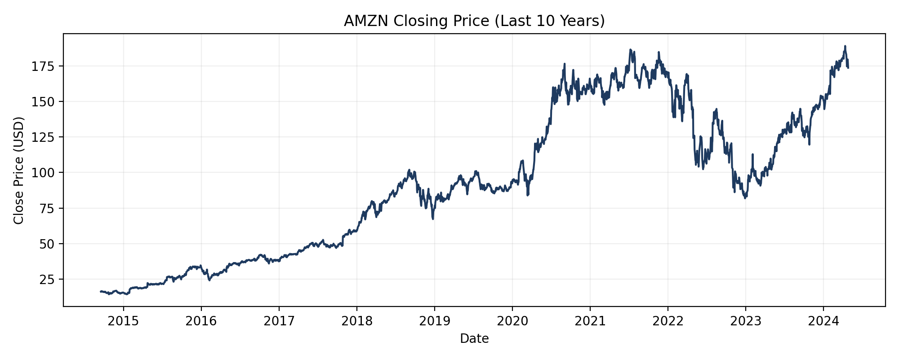

# Amazon Stock Price Prediction (Attention-based Hybrid Models)

Project showcase repo for stock price prediction using deep learning and attention-based hybrid models. Based on the paper **“Application of Attention-Based LSTM Hybrid Models for Stock Price Prediction”** (2024), and implemented primarily in `amazon_stock_prediction.ipynb`.

## Highlights
- **Data**: Amazon (AMZN) daily closing prices (last ~10 years)
- **Models**: LSTM, Self-Attention, CNN-LSTM-Attention, GRU-LSTM-Attention, CNN-BiLSTM-GRU-Attention
- **Metrics**: RMSE, R²
- **Best model (paper)**: CNN-BiLSTM-GRU-Attention (RMSE ≈ 1.0546, R² ≈ 0.9701)

**Preview**



---

## Repository Structure (suggested)
```
stock-prediction-paper/
├── notebooks/
│   └── amazon_stock_prediction.ipynb          # Main notebook (primary implementation)
├── data/
│   ├── amazon_data_close.csv
│   └── stock_data_amazon.csv
├── docs/
│   └── CODE_DOCUMENTATION.md       # Full code walkthrough
├── results/
│   ├── plots/                      # model performance charts
│   └── metrics/                    # RMSE / R2 outputs
└── README.md
```

> Tip: If you publish on GitHub, move `Amazon-Copy1.ipynb` into `notebooks/` and place datasets in `data/`.

---

## Quick Start
```bash
# (Optional) create env
pip install -r requirements.txt

# Run notebook
jupyter notebook notebooks/amazon_stock_prediction.ipynb
```

### Core Dependencies
- `python>=3.9`
- `tensorflow / keras`
- `pandas`, `numpy`, `scikit-learn`
- `ta-lib` (technical indicators)
- `yfinance`, `pandas_datareader`

---

## Results & Comparison

**Model Comparison (from paper)**

| Model | RMSE | R² | Notes |
|---|---:|---:|---|
| LSTM | 2.103577 | 0.881128 | Lowest performance in paper |
| CNN-BiLSTM-GRU-Attention | 1.054589 | 0.970123 | Best performance |
| Self-Attention | See Table 1 in paper | See Table 1 in paper | Reported in paper |
| CNN-LSTM-Attention | See Table 1 in paper | See Table 1 in paper | Reported in paper |
| GRU-LSTM-Attention | See Table 1 in paper | See Table 1 in paper | Reported in paper |


---

## Full Code Documentation
See: **docs/CODE_DOCUMENTATION.md**

---

## Citation
If you use this work, please cite the paper:
> Sun, X. (2024). Application of Attention-Based LSTM Hybrid Models for Stock Price Prediction. *Advances in Economics, Management and Political Sciences*, 104, 77-91.
